# **PENETRATION TESTING REPORT**

## MEDIROZA GENERAL HOSPITAL DOMAIN BLACK-BOX PENETRATION TESTING REPORT
W4-PM1 | CYBERSECURITY |  NETWORKWALKS

| **Penetration Tester** /(Cybersecurity Professional) | Jeffrey Obi |
| :---- | :---- |
| **Program/Batch** | B083-Networkwalks |
| **Date** | 02 October, 2026 |
| **Modules completed** | W4-PM1 (Initial Access) W4-PM2 (Patient Files—Data Extraction and Cracking) W4-PM3 (Staff & Shareholder Data Extraction) W4-PM4 (Reporting) |
| **Client/Target** | Mediroza General Hospital URL: hxxps[:]//medirozahospital[.]com |
| **Written permission secured from target?** | Yes |
| **Download Reports (PDF)** | ****   ****   **.txt)** |

# **1\. Liability Disclaimer**

This project was undertaken for education and research purposes ONLY. All activities were performed only on the device and network that I own, myself. Written permission from the owner of the domain on which this penetration testing exercise was performed, was given.

Testing was limited to the target domain only. No social engineering, no denial of service, and no testing outside agreed scope was attempted.
Do not use anything from here to break the law. The instructor, the author and Networkwalks are not responsible for what you do with this knowledge. Every action you take is your own responsibility. Misuse can lead to criminal charges, heavy fines, loss of your job and a permanent record. In most countries unauthorized access is a crime, even when nothing is damaged.

# **2\. Introduction**

A black box penetration test is a simulated cyberattack where an ethical hacker evaluates a system with no granted access or prior knowledge of its internal architecture, source code, or design.

This report covers a black-box test conducted on the Mediroza General Hospital domain (medirozahospital.com). In this project, I gained internal access to the domain, extracted sensitive files, cracked their encryption, accessed the contents and produced a professional penetration test report, illustrating how an attacker may exploit the system architecture to gain unauthorized access and steal sensitive data.

# **3\. Tools Used**

The table below lists each tool used in this project and its purpose.

| Tool | Purpose |
| :---- | :---- |
| **Kali Linux & Windows** | Operating systems used for reconnaissance activities |
| **whois** | Find domain registration details (owner, dates, name servers). |
| **whatweb** | Fingerprint web technologies (server, CMS, plugins, IP). |
| **nslookup** | Resolve the domain name to its IP address using DNS. |
| **curl \-I** | Read the HTTP response headers of the website. |
| **wafw00f** | Detect whether a Web Application Firewall protects the site. |
| **dnsrecon** | Enumerate all DNS records (NS, MX, SPF, TXT, SRV). |
| **Zenmap (Nmap GUI)** | Scan the local subnet to find live hosts, IPs and MAC addresses. |
| **Firefox** | Web browser used to access web-based penetration testing tools. |
| **Hash Extractor** | Web-based PDF password hash extractor tool created and issued by Networkwalks. |
| **Password Cracker** | Web-based hash-based password cracker created and issued by Networkwalks. |
| **SodaPDF** | PDF viewer installed on Windows machine. |

# **4\. Project Phases**

## **4.1 Initial Access**

I performed reconnaissance against the domain, finding related sub-directories, email addresses, technical back-end information, and registration details. I also found private but exposed portions of the domain.

## **4.2 Patient Files—Data Extraction and Cracking**

I located and extracted three sensitive patient report PDF files, then i cracked their passwords and accessed their contents.

## **4.3 Staff & Shareholder Data Extraction**

I accessed a private database file and retrieved sensitive staff and shareholder details.

## **4.4 Reporting**

I prepared a professional penetration test report, using a required standard framework.

| \# | Risk / Finding | Evidence / Observation | Potential Impact | Risk Level |
| :---: | ----- | ----- | ----- | :---: |
| 1 | Back-end architectural data exposed | Wrong and correctusername guessing revealed account enumeration | Attackers may exploit the back-end  | **High** |
| 2 | Unsecure ports open | Ports with corresponding unencrypted protocols appear open | Provides exploitable entry points on the web server | **Medium** |
| 3 | User authentication flaw exposed | Improper input validation, where login submission with empty password box was permitted | May ease brute-forcing attacks | **High** |
| 4 | SQL misconfiguration | SQL injection test returned a visible database error message | Attackers may infiltrate the directories and steal exposed sensitive data | **High** |
| 5 | Restricted and sensitive records unprotected | Instructions for external crawlers revealed hidden but unprotected domains | Attackers may infiltrate the directory and steal exposed sensitive data | **High** |

The risks above are observations from reconnaissance activities, not confirmed vulnerabilities. The presence of information such as a software version, IP address or DNS record does not by itself mean that the system is vulnerable. Further authorized security testing would be required to confirm any actual vulnerability.

# **6\. Recommendations**

Based on the observations from these activities, I recommend the following security improvements:

1. **Implement Unified Login Messages**  
   Configure the domain to always return a generic error message that does not pinpoint which piece of information was incorrect.

2. **Implement Robust Input Validation and Input Sanitization**  
   Configure proper input validation to minimize the probability of success from brute-force attacks..

3. **Encrypt Back-end File Server**  
   Implement server encryption and access controls on the exposed back-end file server to significantly mitigate the theft of sensitive data.

4. **Encrypt Sensitive Files on the File Server**  
   Encrypt sensitive database files and/or their parent directories.

5. **Implement Crawler Restriction Alternative to robots.txt**  
   Deploy HTTP response tags or HTML meta tags to restrict crawler activity, preventing exposure of internal directories via robots.txt file.

6. **Close all unsecure ports**  
   Close all ports with corresponding unencrypted protocols and open only the secure ports.

# **7\. Conclusion**

During this fourth Week of the Cybersecurity internship programme, I successfully completed a black-box test with written permission from the target.

This project provided immersion into the processes of an attacker bearing the intention of stealing sensitive data. I infiltrated, retrieved files, cracked their encryption and accessed their contents. I also created a professional penetration testing report to document and clearly communicate the findings.

# **8\. Evidence Collected**

## **4.1 Initial Access**

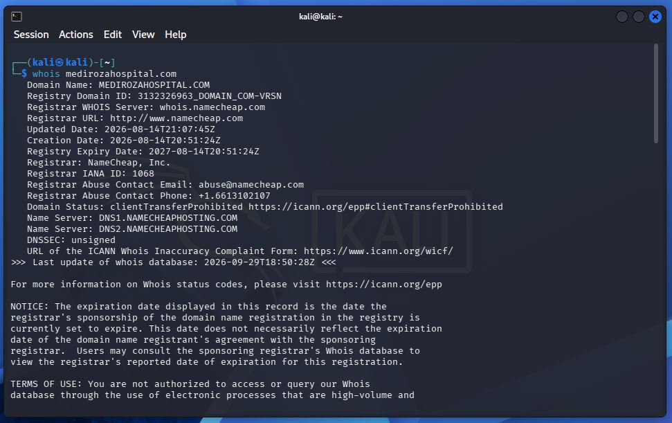

*Figure 1: Screenshot of the **Terminal** interface showing the *whois* command return.*

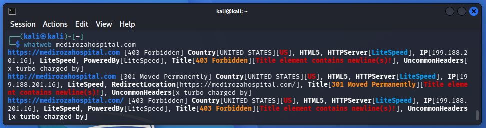

*Figure 2: Screenshot of the **Terminal** interface showing the *whatweb* command return.*

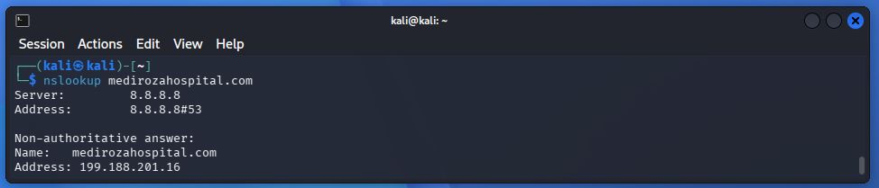

*Figure 3: Screenshot of the **Terminal** interface showing the *nslookup* command return.*

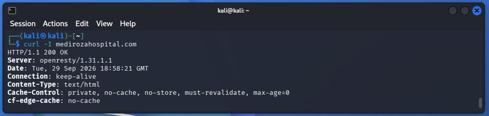

*Figure 4: Screenshot of the **Terminal** interface showing the *curl -I* command return.*

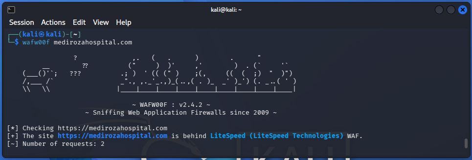

*Figure 5: Screenshot of the **Terminal** interface showing the *wafw00f* command return.*

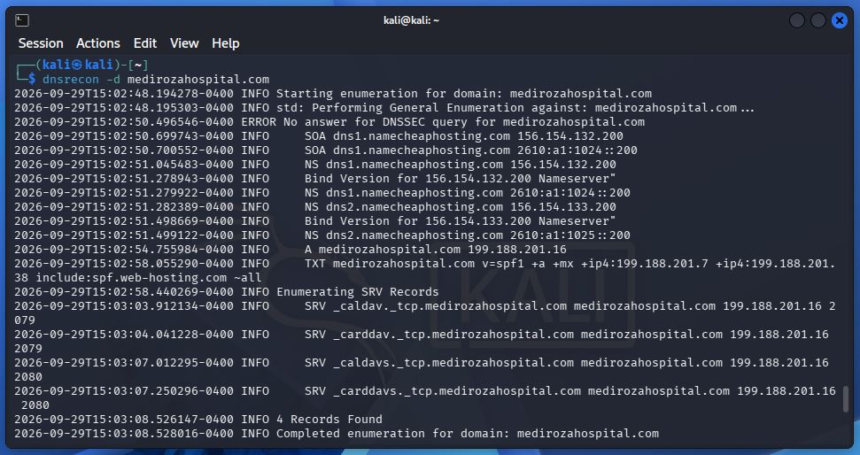

*Figure 6: Screenshot of the **Terminal** interface showing the *DNSrecon* command return.*

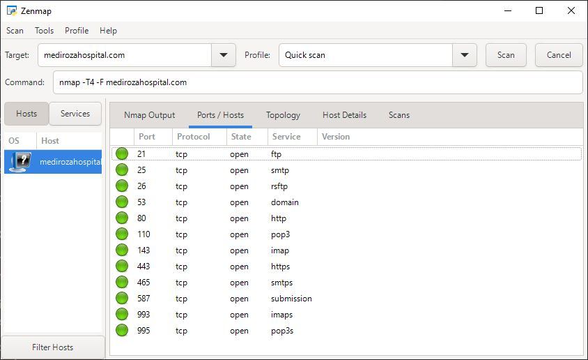

*Figure 7: Screenshot of the **Zenmap** interface showing the scan results.*

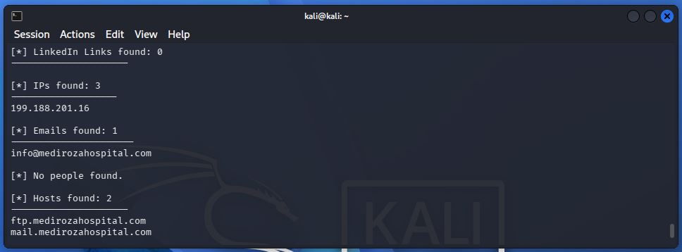

*Figure 8: Screenshot of the **Terminal** interface showing the *theHarvester* command return.*

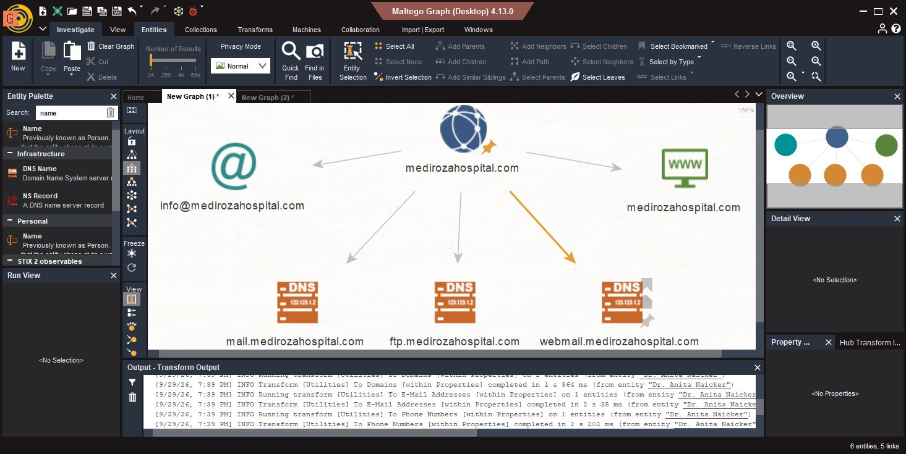

*Figure 9: Screenshot of the **Maltego** interface showing the returned email and domain results.*

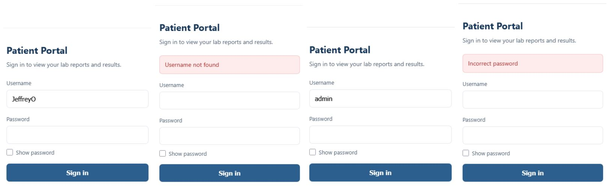

*Figure 10: Screenshot of the **Mediroza General Hospital** website login portal revealing account enumeration and improper input validation.*

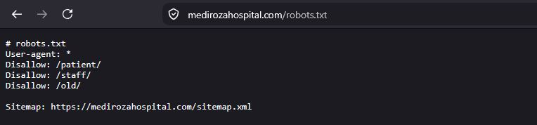

*Figure 11: Screenshot of the **Firefox** interface showing the *robots.txt* contents.*

*Figure 12: Screenshot of the **Firefox** interface showing the patients' PDF reports.*

## **4.2 Patient Files—Data Extraction and Cracking**

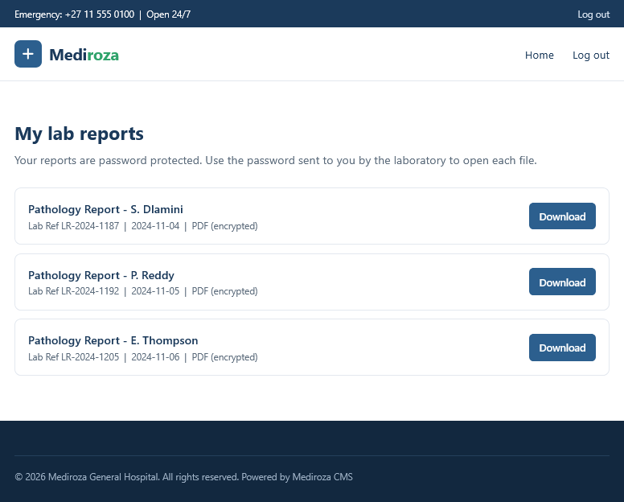

*Figure 13: Screenshot of the **File Explorer** window showing the downloaded PDF reports.*

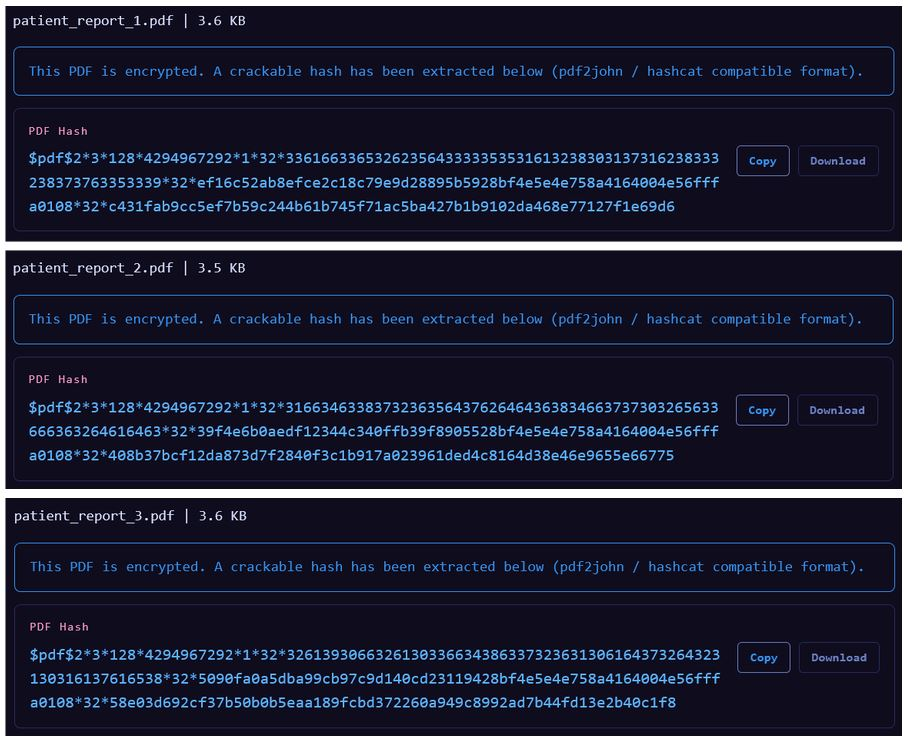

*Figure 14: Screenshots of the **Hash Extractor** interface showing the three returned PDF password hashes.*

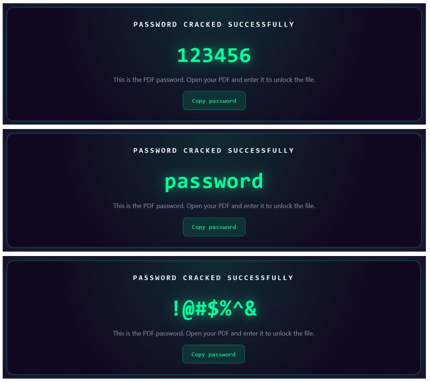

*Figure 15: Screenshots of the **Password Cracker** interface showing the three cracked PDF passwords.*

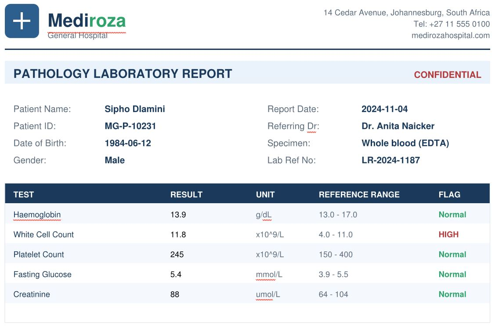

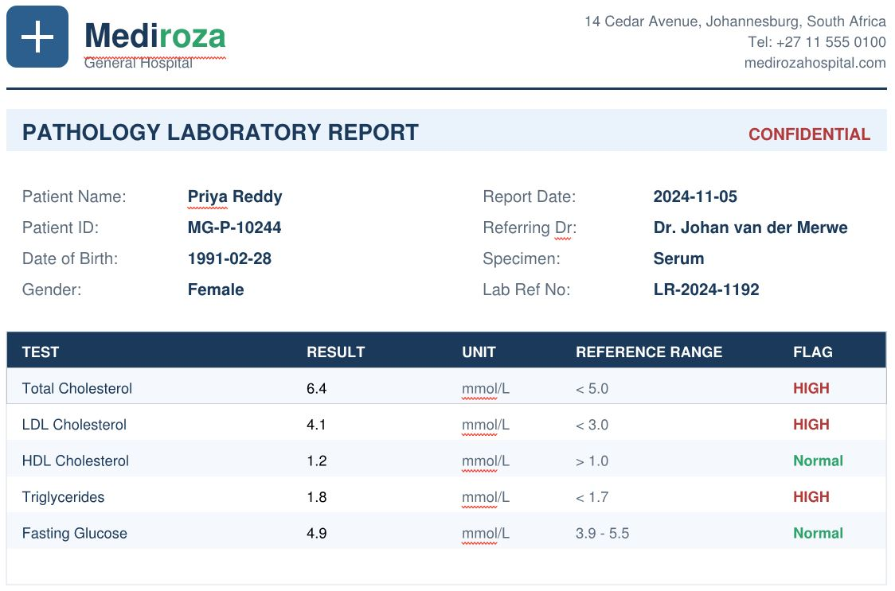

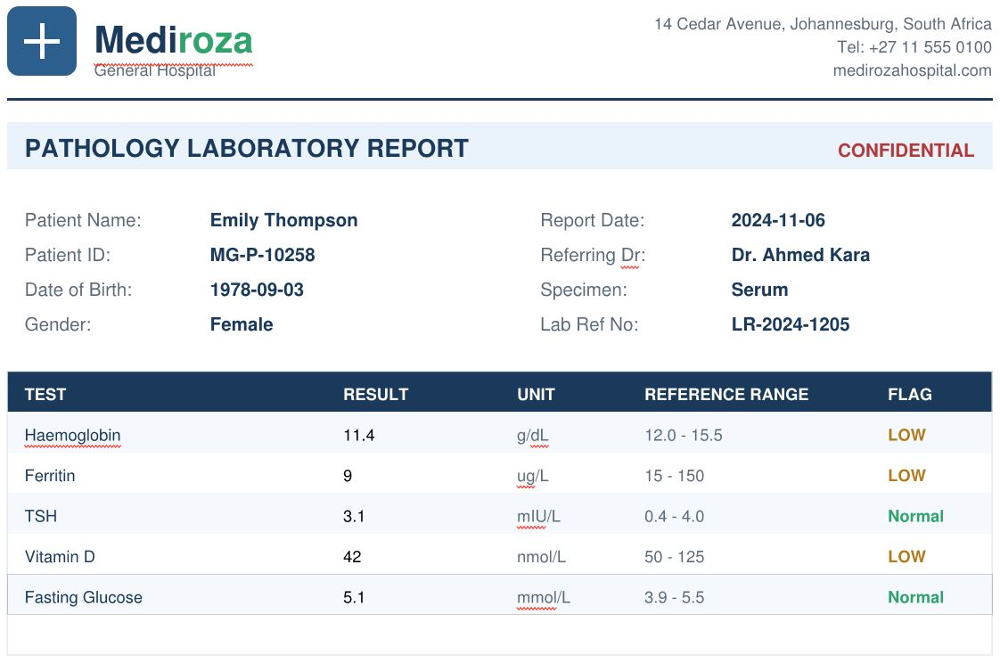

*Figures 16: Screenshots of the three PDF patient reports showing their contents.*

## **4.3 Staff & Shareholder Data Extraction**

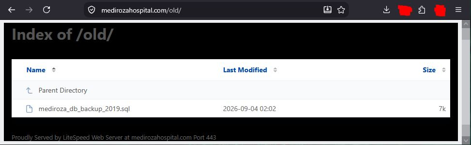

*Figure 17: Screenshot of the **Firefox interface** showing the "old" sub-directory.*

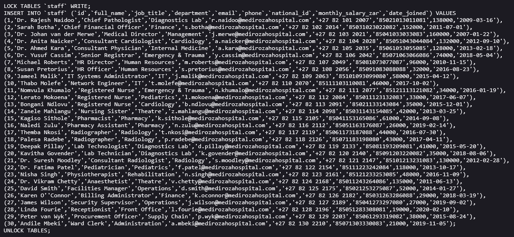

*Figure 18: Screenshot of the SQL database file showing the staff details including names and salaries.*

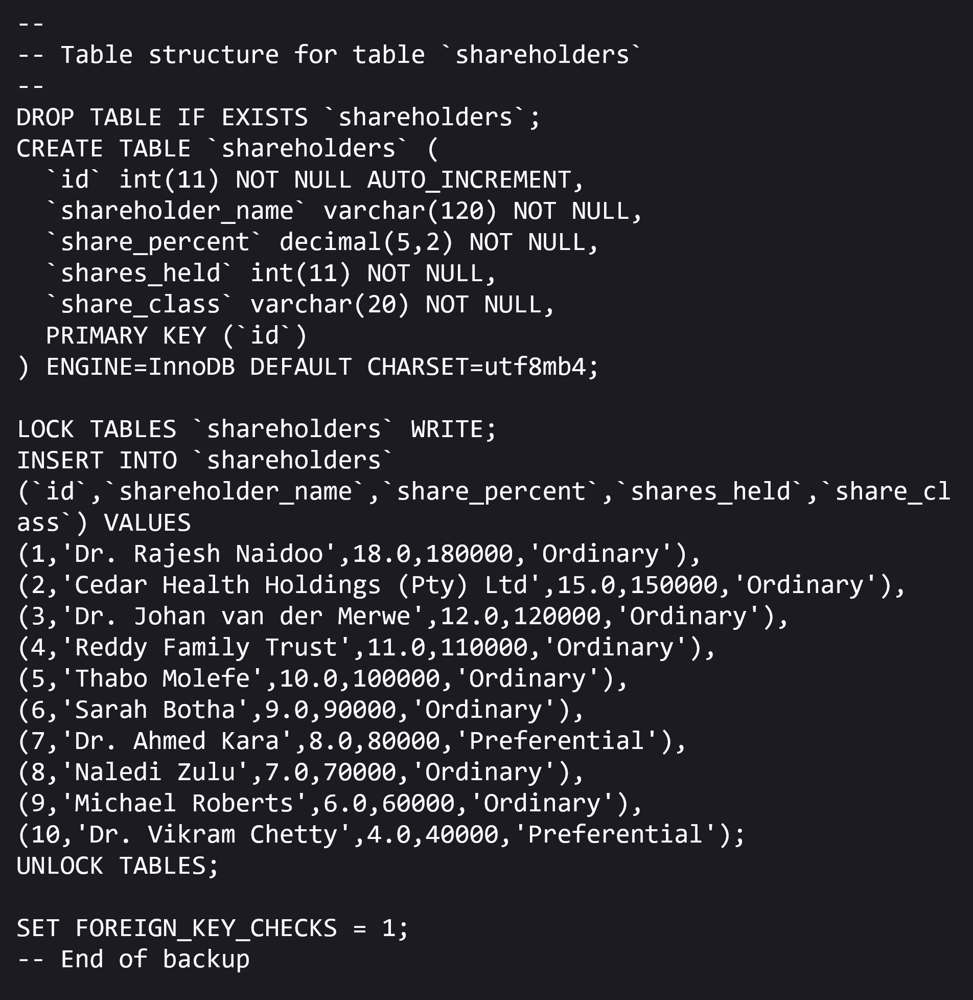

*Figure 19: Screenshot of the SQL database file showing the shareholder details.*

## **4.4 Reporting**

---

**Jeffrey Obi** 
Cybersecurity Professional B083 
**[LinkedIn](https://www.linkedin.com/in/jeffreyoo/)**

---
